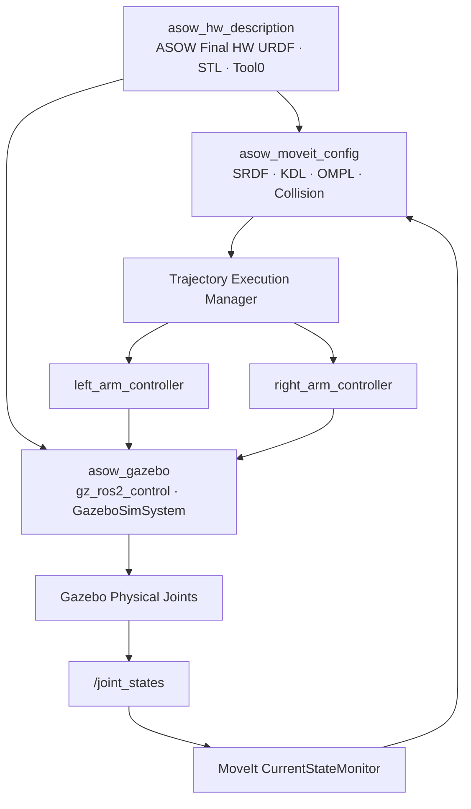

<div align="center">

# ASOW ROS2

### Automatic 3D Printing System On the Wall

Final HW 기준 양팔 로봇 모델링, MoveIt2 경로계획,
ros2_control 및 Gazebo 통합 시뮬레이션 Workspace

<br>


</div>

---

## 1. 프로젝트 개요

ASOW는 전용 선반·벽면 플랫폼을 따라 이동하며 3D 프린터의 상태 확인, 문 개폐, 출력물 및 베드 회수 작업을 자동화하기 위한 양팔 로봇 시스템이다.

이 저장소는 ASOW 프로젝트 중 ROS2 팀이 담당하는 다음 범위를 관리한다.

- Final HW 기준 URDF 및 Mesh
- 좌우 5축 팔과 Tool0
- MoveIt2 Semantic Model
- 좌우 팔 및 양팔 경로계획
- Tool0 기반 역기구학
- Joint Limit 및 Self-Collision 검사
- ros2_control Controller
- Gazebo 물리 시뮬레이션
- MoveIt2–Gazebo 통합 실행
- `/joint_states` Feedback

현재 검증된 전체 실행 경로는 다음과 같다.

```text
ASOW Final HW Model
→ MoveIt2 Planning
→ Trajectory Execution Manager
→ left_arm_controller / right_arm_controller
→ gz_ros2_control
→ GazeboSimSystem
→ Gazebo Physical Joint
→ /joint_states
→ MoveIt CurrentStateMonitor
```

실제 Dynamixel Hardware Interface 연결은 Axis 3에서 진행한다.

---

## 2. 시스템 아키텍처



`both_arms`는 별도의 Controller를 사용하지 않는다.

```text
both_arms RobotTrajectory
├── left_joint1~5  → left_arm_controller
└── right_joint1~5 → right_arm_controller
```

---

## 3. Repository 구조

```text
asow_ws/
├── README.md
├── docs/
│   ├── ENVIRONMENT.md
│   ├── FINAL_HW_GAZEBO_VALIDATION.md
│   ├── system-info.txt
│   ├── installed-packages.txt
│   ├── ros2-package-list.txt
│   └── pip-freeze.txt
│
├── src/
│   ├── asow_hw_description/
│   ├── asow_moveit_config/
│   └── asow_gazebo/
│
├── build/       # colcon 생성, Git 제외
├── install/     # colcon 생성, Git 제외
└── log/         # colcon 생성, Git 제외
```

공식 공유 패키지:

```text
asow_hw_description
asow_moveit_config
asow_gazebo
```

---

## 4. Final HW Robot Model

로봇 자체의 구조와 형상에 대한 Source of Truth:

```text
src/asow_hw_description/urdf/asow_robot.urdf
```

현재 기준:

| 항목 | Final HW 기준 |
|---|---|
| Robot Name | `ASOW` |
| Root Link | `base_link` |
| 왼팔 | `left_joint1` ~ `left_joint5` |
| 오른팔 | `right_joint1` ~ `right_joint5` |
| Revolute Joint | 10 |
| 왼쪽 Tool Frame | `left_tool0` |
| 오른쪽 Tool Frame | `right_tool0` |
| MoveIt Model Frame | `base_link` |
| RViz Fixed Frame | `base_link` |
| Gazebo Entity | `asow` |

Canonical URDF 구조:

```text
base_link
├── left_joint1 → left_link1
│   └── left_joint2 → left_link2
│       └── left_joint3 → left_link3
│           └── left_joint4 → left_link4
│               └── left_joint5 → left_link5
│                   └── left_tool0
│
└── right_joint1 → right_link1
    └── right_joint2 → right_link2
        └── right_joint3 → right_link3
            └── right_joint4 → right_link4
                └── right_joint5 → right_link5
                    └── right_tool0
```

Canonical URDF 구성:

```text
13 Links
12 Joints
├── 10 Revolute
└── 2 Tool0 Fixed
```

`left_tool0`, `right_tool0`는 현재 형상이 없는 fixed frame이며 Tool TCP offset은 추후 실제 Hardware 기준으로 확정한다.

---

## 5. MoveIt2

`asow_moveit_config`는 Final HW URDF를 기반으로 Semantic Model과 Planning 설정을 제공한다.

Planning Group:

| Group | Chain / 구성 | DOF |
|---|---|---:|
| `left_arm` | `base_link → left_tool0` | 5 |
| `right_arm` | `base_link → right_tool0` | 5 |
| `both_arms` | `left_arm + right_arm` | 10 |

주요 구성:

- KDL Kinematics Solver
- OMPL Planning Pipeline
- RRTConnect
- Joint Limit
- Self-Collision Matrix
- FakeSystem
- MoveIt Controller Mapping
- Trajectory Time Parameterization

현재 SRDF에는 `world → base_link` Virtual Joint를 사용하지 않는다.

MoveIt과 RViz의 RobotModel 기준은 다음과 같다.

```text
Model Frame = base_link
```

RViz에는 MoveIt 전용 다음 Parameter를 명시적으로 전달한다.

```text
robot_description
robot_description_semantic
robot_description_kinematics
joint_limits
planning_pipelines
```

이를 통해 Gazebo용 `/robot_description`과 MoveIt RobotModel이 혼합되지 않도록 한다.

---

## 6. Gazebo

Gazebo용 Xacro:

```text
src/asow_gazebo/urdf/asow_gazebo.urdf.xacro
```

Gazebo 모델은 Canonical Final HW URDF를 include하고 simulation에 필요한 요소만 추가한다.

```text
world
└── world_fixed_joint
    └── base_link
```

현재 simulation 배치:

```text
world → base_link

xyz = 0 0 0.15
rpy = 0 0 0
```

`world_fixed_joint`는 Gazebo simulation 전용이다.

MoveIt Semantic Model에서는 별도의 `world` Virtual Joint를 사용하지 않는다.

Gazebo ros2_control Hardware:

```text
GazeboSimSystem
├── left_joint1~5 / position
└── right_joint1~5 / position
```

Controller:

```text
joint_state_broadcaster
left_arm_controller
right_arm_controller
```

Gazebo의 10개 position command limit은 Canonical URDF의 joint position limit과 동일하게 유지한다.

---

## 7. 팀 표준 환경

| 항목 | 기준 |
|---|---|
| OS | Ubuntu 22.04 LTS Desktop |
| ROS | ROS 2 Humble Hawksbill |
| Python | Python 3.10.x |
| Gazebo | Gazebo Fortress LTS |
| ROS–Gazebo | `ros-humble-ros-gz` |
| RViz | RViz2 Humble |
| MoveIt | MoveIt2 Humble |
| Build | colcon |
| Control | ros2_control / ros2_controllers |
| ROS Domain | `11` |

새 터미널:

```bash
source /opt/ros/humble/setup.bash
source ~/asow_ws/install/setup.bash
export ROS_DOMAIN_ID=11
```

개발 Source of Truth:

```text
~/asow_ws/src
```

직접 수정하지 않는 위치:

```text
~/asow_ws/build
~/asow_ws/install
~/asow_ws/log
```

상세 환경:

- `docs/ENVIRONMENT.md`
- `docs/system-info.txt`
- `docs/installed-packages.txt`
- `docs/ros2-package-list.txt`
- `docs/pip-freeze.txt`

---

## 8. Build

반드시 Workspace root에서 실행한다.

```bash
cd ~/asow_ws

source /opt/ros/humble/setup.bash
export ROS_DOMAIN_ID=11

colcon build \
  --symlink-install \
  --packages-select \
  asow_hw_description \
  asow_moveit_config \
  asow_gazebo

source ~/asow_ws/install/setup.bash
```

정상 기준:

```text
Summary: 3 packages finished
```

홈 디렉터리 `~`에서 `colcon build`를 실행하면 홈 디렉터리 아래의 backup workspace까지 package discovery 대상이 되어 duplicate package 오류가 발생할 수 있다.

따라서 Build는 반드시 다음 위치에서 수행한다.

```text
~/asow_ws
```

---

## 9. 실행 모드

### 9.1 URDF / RViz

```bash
ros2 launch \
  asow_hw_description \
  display.launch.py
```

기준:

```text
Fixed Frame = base_link
```

검증 범위:

- Robot Model
- Mesh
- Joint Parent-Child
- Joint Axis
- Tool0
- TF

### 9.2 MoveIt2 FakeSystem

```bash
ros2 launch \
  asow_moveit_config \
  demo.launch.py
```

검증 범위:

- `left_arm`
- `right_arm`
- `both_arms`
- Tool0 IK
- Joint Limit
- Self-Collision
- Plan & Execute

### 9.3 Gazebo Standalone

```bash
ros2 launch \
  asow_gazebo \
  asow_gazebo.launch.py
```

실행 경로:

```text
FollowJointTrajectory
→ JointTrajectoryController
→ gz_ros2_control
→ Gazebo Joint
→ /joint_states
```

### 9.4 MoveIt2–Gazebo Integration

```bash
ros2 launch \
  asow_gazebo \
  asow_moveit_gazebo.launch.py
```

지원 기능:

- `left_arm` Plan & Execute
- `right_arm` Plan & Execute
- `both_arms` Plan & Execute
- Gazebo Physical Motion
- `/joint_states` Feedback

주의:

```text
demo.launch.py
asow_moveit_gazebo.launch.py
```

두 Launch는 동시에 실행하지 않는다.

---

## 10. Runtime 확인

Controller:

```bash
ros2 control list_controllers
```

정상 기준:

```text
joint_state_broadcaster active
left_arm_controller     active
right_arm_controller    active
```

Hardware:

```bash
ros2 control list_hardware_components
```

정상 기준:

```text
GazeboSimSystem
state: active
```

10개 position command interface가 모두 다음 상태여야 한다.

```text
[available] [claimed]
```

Action:

```bash
ros2 action list -t \
  | grep -E \
  'move_action|follow_joint_trajectory'
```

주요 Action:

```text
/move_action
/left_arm_controller/follow_joint_trajectory
/right_arm_controller/follow_joint_trajectory
```

Joint State:

```bash
ros2 topic echo \
  /joint_states \
  --once
```

좌우 총 10개 Revolute Joint가 포함되어야 한다.

Tool0 fixed joint와 Gazebo `world_fixed_joint`는 `/joint_states`에 포함되지 않는다.

Simulation Clock:

```bash
ros2 topic echo /clock --once

ros2 param get \
  /move_group \
  use_sim_time
```

Gazebo 통합 실행 시 정상 기준:

```text
Boolean value is: True
```

---

## 11. 자동 Regression

### 11.1 Exact Tool0 IK

왼팔:

```bash
python3 \
  ~/asow_ws/src/asow_moveit_config/scripts/compute_ik_test.py \
  --ros-args \
  -p use_sim_time:=true \
  -p group_name:=left_arm \
  -p ik_link_name:=left_tool0 \
  -p base_frame:=base_link
```

오른팔:

```bash
python3 \
  ~/asow_ws/src/asow_moveit_config/scripts/compute_ik_test.py \
  --ros-args \
  -p use_sim_time:=true \
  -p group_name:=right_arm \
  -p ik_link_name:=right_tool0 \
  -p base_frame:=base_link
```

Final HW 기준 현재 Tool0 Exact Pose는 좌우 모두 IK 성공이 검증되어 있다.

한쪽 팔은 5DOF이므로 임의의 위치와 방향을 동시에 강제하는 모든 6D Pose를 만족하는 것은 보장하지 않는다.

### 11.2 Self-Collision

```bash
python3 \
  ~/asow_ws/src/asow_moveit_config/scripts/collision_sampling_test.py \
  --ros-args \
  -p use_sim_time:=true
```

기본 deterministic regression:

```text
Home                       1
Single-joint extrema      20
All-joint extrema       1024
Left uniform            1000
Right uniform           1000
Both uniform            5000
Boundary stress         2000
────────────────────────────
Total                  10045
```

검증된 baseline:

```text
tested:               10045
valid:                 4371
collision:             5674
noncollision_invalid:  0
service_failure:       0
collision detection:   56.49%
```

56.49%는 정의된 sampling distribution에서 collision으로 판정된 비율이며 실제 운용 중 충돌 발생률을 의미하지 않는다.

현재 Collision Matrix 정책:

```text
Adjacent exclusion: 10 pairs
```

---

## 12. Final HW Gazebo 검증 상태

| 항목 | 상태 |
|---|---|
| Final HW Canonical URDF | PASS |
| 10 Revolute Joint 이름/순서 | PASS |
| Gazebo Position Limit 일치 | PASS |
| GazeboSimSystem | PASS |
| Controller 3개 Active | PASS |
| `/joint_states` 10 Joint | PASS |
| Gazebo Standalone Trajectory | PASS |
| `left_arm` Plan & Execute | PASS |
| `right_arm` Plan & Execute | PASS |
| `both_arms` Plan & Execute | PASS |
| MoveIt / RViz Frame Consistency | PASS |
| Left Exact IK | PASS |
| Right Exact IK | PASS |
| 10,045-state Collision Regression | PASS |
| MoveIt FakeSystem Regression | PASS |
| 3-package Build | PASS |

상세 검증 기록:

```text
docs/FINAL_HW_GAZEBO_VALIDATION.md
```

---

## 13. 현재 임시값 및 Hardware 확정 필요 항목

현재 simulation 기준:

| 항목 | 현재 값 |
|---|---:|
| Home | 전체 `0 rad` |
| Tool0 Offset | `xyz=0, rpy=0` |
| Gazebo `world → base_link` | `z=0.15 m` |
| URDF Effort Limit | 임시값 |
| URDF Velocity Limit | 임시값 |

실제 Hardware 연결 전에 확정할 항목:

- Dynamixel 모델 및 ID
- 실제 기계 영점
- Encoder ↔ rad 변환
- Joint 회전 방향
- Homing Offset
- 실제 Velocity Limit
- 실제 Current / Torque Limit
- Tool TCP
- Payload
- 케이블 간섭 안전 범위

현재 simulation 값을 실제 로봇의 최종 안전 운용값으로 사용하지 않는다.

---

## 14. 다음 개발 단계

### Axis 3 — Dynamixel Hardware Interface

목표:

```text
MoveIt2
→ left/right JointTrajectoryController
→ ros2_control
→ ASOW Dynamixel Hardware Interface
→ Dynamixel
→ Joint State Feedback
```

Gazebo와 실제 Hardware는 상위 MoveIt / Controller interface를 동일하게 유지한다.

초기 Hardware 검증 순서:

```text
Motor inventory
→ 1 motor communication
→ per-motor verification
→ 10 motor read-only
→ one joint
→ one arm
→ both arms
→ MoveIt execution
```

초기 Position Control에서는 실제 state로 command를 초기화한 뒤 Torque Enable하여 torque-on jump를 방지한다.

---

## 15. Git 기준

개발 Source of Truth:

```text
UTM Ubuntu ~/asow_ws
```

GitHub는 검증 후 push된 공유 상태이다.

개발 순서:

```text
local inspect
→ modify
→ build
→ runtime validation
→ git diff
→ stage
→ commit
→ push
→ remote SHA verify
```

검증되지 않은 중간 상태에는 handoff tag를 생성하지 않는다.

---

## 16. 문서

- [팀 표준 환경](docs/ENVIRONMENT.md)
- [Final HW Gazebo 검증 기록](docs/FINAL_HW_GAZEBO_VALIDATION.md)
- [시스템 정보](docs/system-info.txt)
- [설치 패키지 목록](docs/installed-packages.txt)
- [ROS2 패키지 목록](docs/ros2-package-list.txt)
- [Python 패키지 목록](docs/pip-freeze.txt)

프로젝트의 상세 설계 판단과 개발 과정은 팀 Notion에서 관리한다.

---

<div align="center">

**ASOW ROS2 Team**

Robot Model · Motion Planning · Simulation · Control

</div>
