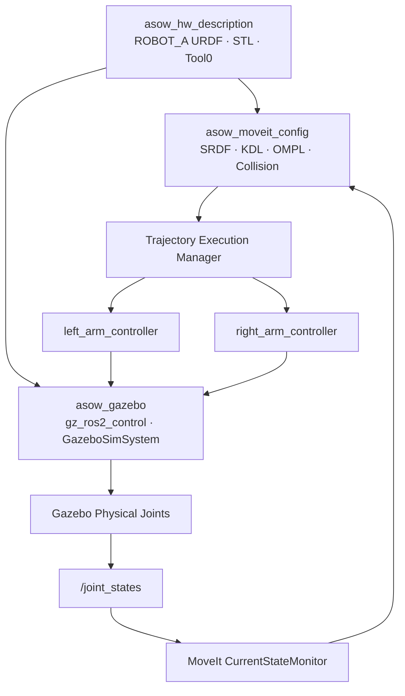

<div align="center">

# ASOW ROS2

### Automatic 3D Printing System On the Wall

CAD 기반 양팔 로봇의 모델링, MoveIt2 경로계획,  
ros2_control 및 Gazebo 통합 시뮬레이션 Workspace

<br>


</div>

---

## 1. 프로젝트 개요

ASOW는 전용 선반·벽면 플랫폼을 따라 이동하며 3D 프린터의 상태 확인, 문 개폐, 출력물 및 베드 회수 작업을 자동화하기 위한 양팔 로봇 시스템이다.

이 저장소는 ASOW 프로젝트 중 ROS2 팀이 담당하는 다음 범위를 관리한다.

- CAD 기반 로봇 모델
- URDF 및 TF
- 좌우 팔과 양팔 경로계획
- Tool0 기반 역기구학
- Joint Limit 및 Self-Collision 검사
- ros2_control Controller
- Gazebo 물리 시뮬레이션
- MoveIt2–Gazebo 통합 실행
- Gazebo Joint State Feedback

현재 저장소의 기준 범위는 다음과 같다.

> Robot Model → Planning → Controller → Gazebo Execute → Joint State Feedback

실제 Dynamixel 모터 제어는 다음 개발 단계에서 연결한다.

---

## 2. 시스템 아키텍처



통합 실행 흐름:

```text
RViz MotionPlanning
→ move_group
→ KDL IK 또는 Joint Goal
→ OMPL Planning
→ Trajectory Time Parameterization
→ Trajectory Execution Manager
→ left_arm_controller / right_arm_controller
→ gz_ros2_control
→ Gazebo Joint
→ joint_state_broadcaster
→ /joint_states
→ MoveIt CurrentStateMonitor
```

---

## 3. Repository 구조

```text
asow_ws/
├── README.md
├── .gitignore
├── docs/
│   ├── ENVIRONMENT.md
│   ├── system-info.txt
│   ├── installed-packages.txt
│   ├── ros2-package-list.txt
│   └── pip-freeze.txt
│
├── src/
│   ├── asow_hw_description/
│   ├── asow_moveit_config/
│   └── asow_gazebo/
│
├── build/       # colcon 생성, Git 제외
├── install/     # colcon 생성, Git 제외
└── log/         # colcon 생성, Git 제외
```

공식 공유 패키지는 다음 세 개이다.

```text
asow_hw_description
asow_moveit_config
asow_gazebo
```

초기 개발에 사용했던 `asow_description` 패키지는 현재 기준 패키지가 아니며 이 저장소의 공식 실행 구조에 포함하지 않는다.

---

## 4. ROS2 패키지

### 4.1 `asow_hw_description`

ASOW 로봇 자체의 환경 독립적인 기준 모델을 관리한다.

주요 책임:

- `ROBOT_A` 기준 URDF
- 중앙 Base와 좌우 5축 팔
- Link 및 Joint Parent-Child 구조
- Joint Origin 및 Axis
- Joint Position Limit
- Visual 및 Collision Mesh
- Mass, Center of Mass, Inertia
- `left_tool0`, `right_tool0`
- RViz 단독 모델 검증

기준 파일:

```text
src/asow_hw_description/urdf/robot_a.urdf
```

---

### 4.2 `asow_moveit_config`

기준 URDF에 MoveIt2 Semantic Model과 Planning 설정을 추가한다.

주요 책임:

- `world` Virtual Joint
- `left_arm`
- `right_arm`
- `both_arms`
- KDL Kinematics Solver
- OMPL Planning Pipeline
- Joint Velocity 및 Acceleration Limit
- Self-Collision Matrix
- FakeSystem
- MoveIt Controller Mapping
- Trajectory Time Parameterization
- IK 및 Collision 자동 검증 스크립트

Planning Group:

| Group | 구성 | 자유도 | 용도 |
|---|---:|---:|---|
| `left_arm` | `base_link-v1 → left_tool0` | 5 | 왼팔 Planning 및 IK |
| `right_arm` | `base_link-v1 → right_tool0` | 5 | 오른팔 Planning 및 IK |
| `both_arms` | `left_arm + right_arm` | 10 | 양팔 동시 Joint-space Planning |

---

### 4.3 `asow_gazebo`

MoveIt2가 생성한 Trajectory를 Gazebo 물리 Joint에서 실행하는 Runtime 패키지이다.

주요 책임:

- Gazebo World 실행
- `ROBOT_A` Entity Spawn
- `world → base_link-v1` 고정
- `GazeboSimSystem`
- `gz_ros2_control`
- `controller_manager`
- 좌우 JointTrajectoryController
- `/clock` Bridge
- `/joint_states` Feedback
- MoveIt2–Gazebo 통합 Launch

Controller:

```text
joint_state_broadcaster
left_arm_controller
right_arm_controller
```

양팔 실행을 위한 별도의 `both_arms_controller`는 사용하지 않는다.

```text
both_arms RobotTrajectory
├── 왼팔 5 Joint → left_arm_controller
└── 오른팔 5 Joint → right_arm_controller
```

---

## 5. Robot Model 기준

| 항목 | 현재 기준 |
|---|---|
| Robot Model | `ROBOT_A` |
| 중앙 Base | `base_link-v1` |
| 왼팔 | 5 Revolute Joint |
| 오른팔 | 5 Revolute Joint |
| 전체 가동 Joint | 10 |
| 왼쪽 작업 Frame | `left_tool0` |
| 오른쪽 작업 Frame | `right_tool0` |
| MoveIt Planning Frame | `world` |
| Gazebo Entity | `ROBOT_A` |

모델 범위별 Link 및 Joint 수:

| 모델 범위 | Link | Joint | Root |
|---|---:|---:|---|
| CAD 형상 | 11 | 10 Revolute | `base_link-v1` |
| 기준 URDF | 13 | 12 | `base_link-v1` |
| Gazebo 확장 모델 | 14 | 13 | `world` |

기준 URDF에는 형상이 없는 Tool0 Link 두 개가 포함된다.

Gazebo 확장 모델에는 다음이 추가된다.

```text
world
└── world_fixed_joint
    └── base_link-v1
```

---

## 6. 팀 표준 환경

| 항목 | 기준 |
|---|---|
| OS | Ubuntu 22.04 LTS Desktop 64-bit |
| ROS | ROS 2 Humble Hawksbill |
| Python | Python 3.10.x |
| Gazebo | Gazebo Fortress LTS |
| ROS–Gazebo | `ros-humble-ros-gz` |
| RViz | RViz2 Humble |
| MoveIt | MoveIt2 Humble |
| Build | colcon, rosdep, vcstool |
| Control | ros2_control, ros2_controllers |
| IDE | VSCode |

현재 개발 VM의 실제 Architecture와 설치 패키지 버전은 다음 문서를 참조한다.

- [`docs/ENVIRONMENT.md`](docs/ENVIRONMENT.md)
- [`docs/system-info.txt`](docs/system-info.txt)
- [`docs/installed-packages.txt`](docs/installed-packages.txt)
- [`docs/ros2-package-list.txt`](docs/ros2-package-list.txt)
- [`docs/pip-freeze.txt`](docs/pip-freeze.txt)

---

## 7. 처음 설치하는 팀원

저장소는 `~/asow_ws` 위치에 Clone하는 것을 기준으로 한다.

```bash
cd ~

git clone \
  git@github.com:<GITHUB_USERNAME>/asow_ros2.git \
  asow_ws

cd ~/asow_ws
```

ROS2 환경을 적용한다.

```bash
source /opt/ros/humble/setup.bash
```

패키지 의존성을 설치한다.

```bash
rosdep install \
  --from-paths src \
  --ignore-src \
  -r \
  -y
```

Workspace를 빌드한다.

```bash
colcon build \
  --symlink-install \
  --packages-select \
  asow_hw_description \
  asow_moveit_config \
  asow_gazebo
```

빌드 결과를 현재 터미널에 적용한다.

```bash
source ~/asow_ws/install/setup.bash
```

새 터미널을 열 때마다 다음 두 명령을 실행해야 한다.

```bash
source /opt/ros/humble/setup.bash
source ~/asow_ws/install/setup.bash
```

정상 빌드 기준:

```text
Summary: 3 packages finished
```

---

## 8. 실행 모드

### 8.1 URDF 및 RViz 단독 검증

로봇 형상, TF, Joint Axis 및 Parent-Child 움직임을 확인한다.

```bash
ros2 launch \
  asow_hw_description \
  display.launch.py
```

실행 구성:

```text
robot_state_publisher
joint_state_publisher_gui
RViz2
```

RViz Fixed Frame:

```text
base_link-v1
```

---

### 8.2 MoveIt2 FakeSystem

Gazebo 없이 MoveIt2 Planning과 Controller Mapping을 검증한다.

```bash
ros2 launch \
  asow_moveit_config \
  demo.launch.py
```

검증 가능 항목:

- `left_arm` Planning
- `right_arm` Planning
- `both_arms` Planning
- Tool0 IK
- Joint Limit
- Self-Collision
- FakeSystem 기반 Plan & Execute

---

### 8.3 Gazebo 기본 연동

MoveIt2를 제외하고 Gazebo와 ros2_control Controller를 직접 검증한다.

```bash
ros2 launch \
  asow_gazebo \
  asow_gazebo.launch.py
```

제어 흐름:

```text
FollowJointTrajectory Goal
→ JointTrajectoryController
→ gz_ros2_control
→ Gazebo Joint
→ /joint_states
```

---

### 8.4 MoveIt2–Gazebo 통합

현재 축 2의 최종 통합 실행이다.

```bash
ros2 launch \
  asow_gazebo \
  asow_moveit_gazebo.launch.py
```

지원 기능:

- `left_arm` Plan & Execute
- `right_arm` Plan & Execute
- `both_arms` Plan & Execute
- `left_tool0` IK 및 Execute
- `right_tool0` IK 및 Execute
- Joint Limit 적용
- Self-Collision-aware Planning
- Gazebo Joint State Feedback

RViz 설정:

```text
Fixed Frame: world
Start State: <current>
Velocity Scaling: 0.10
Acceleration Scaling: 0.10
```

---

## 9. 중요 실행 규칙

> [!WARNING]
> `demo.launch.py`와 `asow_moveit_gazebo.launch.py`는 동시에 실행하지 않는다.

두 Launch를 동시에 실행하면 다음 항목이 중복될 수 있다.

```text
/controller_manager
/joint_state_broadcaster
/left_arm_controller
/right_arm_controller
/robot_state_publisher
```

이 경우 MoveIt2가 명령을 전달한 Controller와 `/joint_states`를 발행하는 Hardware System이 달라질 수 있다.

정상 운영 규칙:

| 테스트 목적 | 실행 Launch |
|---|---|
| MoveIt2 FakeSystem | `asow_moveit_config demo.launch.py` |
| Gazebo Controller | `asow_gazebo asow_gazebo.launch.py` |
| MoveIt2–Gazebo 통합 | `asow_gazebo asow_moveit_gazebo.launch.py` |

---

## 10. 실행 상태 검증

### Controller 상태

```bash
ros2 control list_controllers
```

정상 결과:

```text
joint_state_broadcaster  active
left_arm_controller      active
right_arm_controller     active
```

### Action Server

```bash
ros2 action info \
  /left_arm_controller/follow_joint_trajectory
```

```bash
ros2 action info \
  /right_arm_controller/follow_joint_trajectory
```

각각 정상 결과:

```text
Action servers: 1
```

### Joint State

```bash
ros2 topic echo \
  /joint_states \
  --once
```

좌우 10개 Revolute Joint가 포함되어야 한다.

```text
왼팔 Joint: 5개
오른팔 Joint: 5개
전체: 10개
```

Tool0 Fixed Joint와 `world_fixed_joint`는 `/joint_states`에 포함되지 않는다.

### Simulation Clock

```bash
ros2 topic echo \
  /clock \
  --once
```

```bash
ros2 param get \
  /move_group \
  use_sim_time
```

정상 결과:

```text
Boolean value is: True
```

### 중복 Node

```bash
ros2 node list \
  | sort \
  | uniq -d
```

정상 결과:

```text
출력 없음
```

---

## 11. 자동 검증 스크립트

자동 검증 스크립트는 MoveIt2 또는 MoveIt2–Gazebo 환경이 실행된 상태에서 사용한다.

### Tool0 IK 검증

```bash
python3 \
  ~/asow_ws/src/asow_moveit_config/scripts/compute_ik_test.py \
  --ros-args \
  -p use_sim_time:=true
```

검증 항목:

- `/compute_ik` Service 연결
- 현재 Tool0 Pose Exact IK
- Position 변경과 Orientation 고정 요청
- 5자유도 팔의 `NO_IK_SOLUTION` 응답

한쪽 팔은 5자유도이므로 임의의 모든 6차원 Pose를 항상 만족할 수 없다.

`NO_IK_SOLUTION`, Error Code `-31`은 요청한 위치와 방향 조합에 해가 없을 때 발생할 수 있으며, 반드시 설정 오류를 의미하지 않는다.

### Self-Collision 검사

```bash
python3 \
  ~/asow_ws/src/asow_moveit_config/scripts/collision_sampling_test.py \
  --ros-args \
  -p use_sim_time:=true \
  -p random_samples:=5000 \
  -p seed:=42
```

검증 항목:

- Home State
- Joint 최소·최대 조합
- Random Robot State
- 전체 Robot Self-Collision
- `/check_state_validity` Service

현재 Collision Matrix 정책:

```text
Adjacent Pair 제외: 10개
Never Pair 제외: 0개
```

---

## 12. 현재 완료 상태

| 기능 | 상태 |
|---|---|
| CAD 기반 기준 URDF | 완료 |
| RViz RobotModel 및 TF | 완료 |
| 좌우 Joint 종속 움직임 | 완료 |
| `left_tool0`, `right_tool0` | 완료 |
| `left_arm` Planning | 완료 |
| `right_arm` Planning | 완료 |
| `both_arms` Planning | 완료 |
| 좌우 KDL IK | 완료 |
| OMPL Planning | 완료 |
| Joint Limit 적용 | 완료 |
| Self-Collision 검사 | 완료 |
| FakeSystem 실행 | 완료 |
| GazeboSimSystem | 완료 |
| 좌우 Controller 실행 | 완료 |
| MoveIt2–Gazebo 통합 | 완료 |
| 좌우 Plan & Execute | 완료 |
| 양팔 Plan & Execute | 완료 |
| Joint State Feedback | 완료 |
| Clean Launch 재실행 | 완료 |

---

## 13. 현재 임시값과 미확정값

### 시뮬레이션 검증용 임시값

| 항목 | 현재 값 |
|---|---:|
| 최대 Joint 속도 | `0.5 rad/s` |
| 최대 Joint 가속도 | `0.5 rad/s²` |
| Velocity Scaling | `0.1` |
| Acceleration Scaling | `0.1` |
| Home Joint 값 | 전체 `0 rad` |
| Tool0 Offset | `xyz=0, rpy=0` |
| `world → base_link-v1` | `z=0.15 m` |

### 실제 Hardware 연동 후 확정할 항목

- 실제 Tool TCP
- 실제 End Effector Group
- Dynamixel 모델 및 ID
- 실제 기계 영점
- 모터 회전 방향
- 실제 속도 및 가속도
- Torque Limit
- Current Limit
- 케이블 간섭 안전 범위
- 실제 Payload
- 실제 Task용 IK 제약
- Tool 교체 구조

> [!CAUTION]
> 현재 Joint Limit과 속도·가속도 값은 시뮬레이션 검증 기준이다.  
> 실제 로봇의 최종 안전 운용 범위로 사용해서는 안 된다.

---

## 14. Troubleshooting

### Robot Mesh가 표시되지 않는 경우

STL 파일을 확인한다.

```bash
find \
  ~/asow_ws/src/asow_hw_description/meshes \
  -maxdepth 1 \
  -name '*.stl' \
  | wc -l
```

정상 결과:

```text
11
```

### Controller가 중복되는 경우

실행 중인 FakeSystem과 Gazebo Launch가 동시에 존재하는지 확인한다.

```bash
ros2 node list \
  | sort \
  | uniq -d
```

기존 Launch 터미널에서 `Ctrl+C`로 종료한 뒤 하나의 실행 환경만 다시 실행한다.

### MoveIt2가 현재 상태를 오래된 상태로 판단하는 경우

다음을 확인한다.

```bash
ros2 topic echo /clock --once
ros2 param get /move_group use_sim_time
ros2 topic echo /joint_states --once
```

### Planning은 성공하지만 Execute가 실패하는 경우

다음을 확인한다.

```bash
ros2 param get \
  /move_group \
  ompl.request_adapters
```

출력에 다음 Adapter가 포함되어야 한다.

```text
default_planner_request_adapters/AddTimeOptimalParameterization
```

Controller Action Server도 각각 한 개 존재해야 한다.

### Tool0 Pose Goal에서 IK가 실패하는 경우

다음 순서로 구분한다.

```text
1. Joint-space Planning 성공 여부
2. 현재 Tool0 Pose IK 성공 여부
3. Planning Group과 Tip Link
4. /joint_states 수신 여부
5. Exact Pose 요청 여부
6. 5자유도와 6차원 Pose 제약 관계
```

---

## 15. 개발 규칙

직접 수정하는 위치:

```text
~/asow_ws/src
```

직접 수정하지 않는 위치:

```text
~/asow_ws/build
~/asow_ws/install
~/asow_ws/log
```

코드를 수정한 뒤 다시 빌드한다.

```bash
cd ~/asow_ws

source /opt/ros/humble/setup.bash

colcon build \
  --symlink-install \
  --packages-select \
  asow_hw_description \
  asow_moveit_config \
  asow_gazebo

source install/setup.bash
```

Git 반영:

```bash
git status
git add src README.md docs
git commit -m "수정 내용"
git push
```

팀원이 최신 코드를 받을 때:

```bash
cd ~/asow_ws

git pull

colcon build \
  --symlink-install

source install/setup.bash
```

---

## 16. 다음 개발 단계

### Axis 3 — Dynamixel Hardware

```text
GazeboSimSystem
→ ros2_control Dynamixel Hardware Interface
→ 실제 Dynamixel Motor
→ Joint State Feedback
```

상위 구조는 유지한다.

```text
MoveIt2
→ FollowJointTrajectory
→ left_arm_controller / right_arm_controller
→ ros2_control Hardware Interface
→ Dynamixel
```

### Axis 4 — Vision Integration

```text
OAK-D RGB/Depth
→ Object 3D Coordinate
→ Eye-to-Hand Transformation
→ base_link 기준 Target Pose
→ Tool0 Pose Goal
→ MoveIt2
```

### Axis 5 — Task Integration

```text
IDLE
→ VALIDATE
→ MOVE
→ INSPECT
→ OPEN
→ UNLOAD
→ RESTORE
→ REPORT
```

---

## 17. 팀원 인수인계 완료 기준

팀원이 저장소를 받은 뒤 다음 항목을 완료하면 인수인계가 완료된 것으로 판단한다.

- [ ] 저장소 Clone
- [ ] `rosdep install`
- [ ] 세 패키지 Build
- [ ] URDF 및 RViz 실행
- [ ] MoveIt2 FakeSystem 실행
- [ ] MoveIt2–Gazebo 통합 실행
- [ ] Controller 3개 Active 확인
- [ ] `/joint_states`에 10개 Joint 확인
- [ ] `left_arm` Plan & Execute
- [ ] `right_arm` Plan & Execute
- [ ] `both_arms` Plan & Execute
- [ ] 종료 후 재실행 성공
- [ ] 중복 Node 없음

---

## 18. 문서

- [팀 표준 환경](docs/ENVIRONMENT.md)
- [시스템 정보](docs/system-info.txt)
- [설치 패키지 목록](docs/installed-packages.txt)
- [ROS2 패키지 목록](docs/ros2-package-list.txt)
- [Python 패키지 목록](docs/pip-freeze.txt)

프로젝트의 설계 판단, 진행 과정 및 문제 해결 기록은 팀 Notion에서 관리한다.

---

<div align="center">

**ASOW ROS2 Team**

Robot Model · Motion Planning · Simulation · Control

</div>
